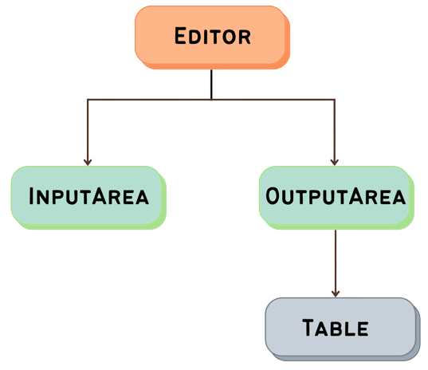

<h1 align="center"><b>SQL Editor</b></h1>
A dummy web application capable of running and displaying results of SQL queries.

## Overview
The whole app is structured, as shown in the image below.

A component editor has two child component: 
1. InputArea
2. OutputArea

`InputArea` is responsible for taking SQL queries from the user. In the input section, user can either run their query or use predefined examples. Every example has a different predefined result, while in edit mode response will be random.

`OutputArea` is responsible for making API calls to fetch data and deciding whether we need to present a table or error message. In the case of displaying a table, the `outputArea` will pass the list of responses from a server to the `Table` component that generates an output table for the user.

## Tech Stack and Libraries
- HTML
- CSS
- Bootstrap
- React
- Axios
- JSONplaceholder (For data fetching)

## Load / Render Time
Overall rendering time of application is `213.7ms`, measured using `React Profiler`.

## Optimisations

To optimize the overall performance app is divided into different components. Every component in the app renders only for particular operations. While taking input, only the `InputArea` will render till the user press the run button, same applies to other components as well.
